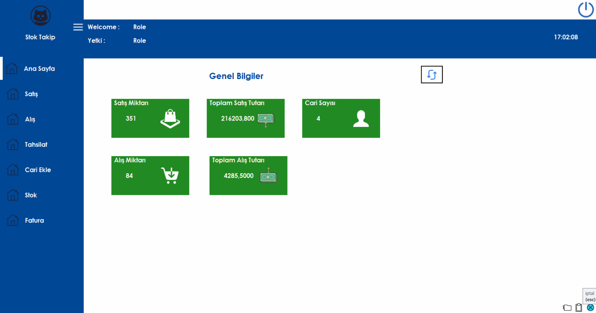

# kodluyoruzilkrepo
Bu repo [Kodluyoruz](https://www.kodluyoruz.org) Eğitimi kapsamında açtığım ilk repo



## Installation

Öncelikle projeyi clonelayın. 

```bash
git clone https://github.com/fahricankacan/kodluyoruzilkrepo
 ```

 ## Usage
 Projeyi cloneladıktan sonra Visual Studio Code programında açınız.

 ```linux
 cd kodluyoruzilkrepo
 code .
 ```

 ## Contributing
 Pull requestler kabul edilir. Büyük değişikliker için , lütfen önce neyi değişirmek istediğinizi tartışmak için bir konu açınız.

 ##Lisance
 [MIT](https://choosealicense.com/licenses/mit/)
